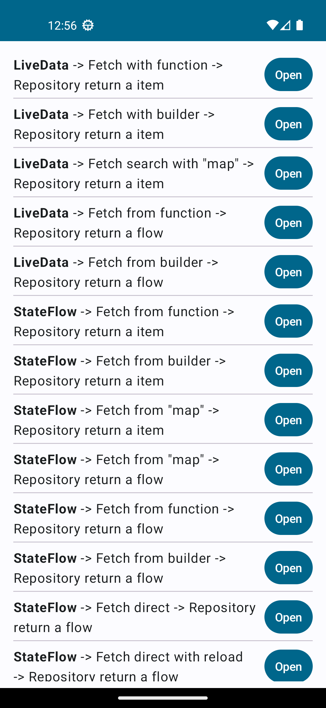

# Flow Playground

This is a very simple app that I used to test how Flow collect works compared with LiveData.

The app has a generic UI with general test cases such as collecting a Flow from a variable, function, combining flows, map and some others.

This is not a sample to define the correct way to use the Flow, it's just several test cases, right or not.

The app uses the API from https://github.com/15Dkatz/official_joke_api
